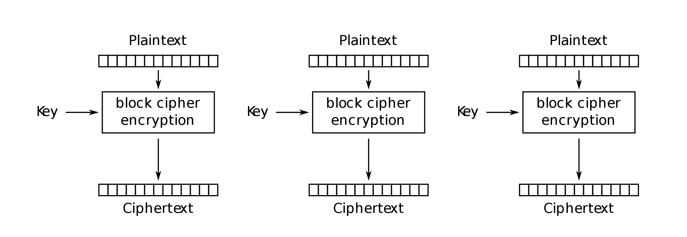
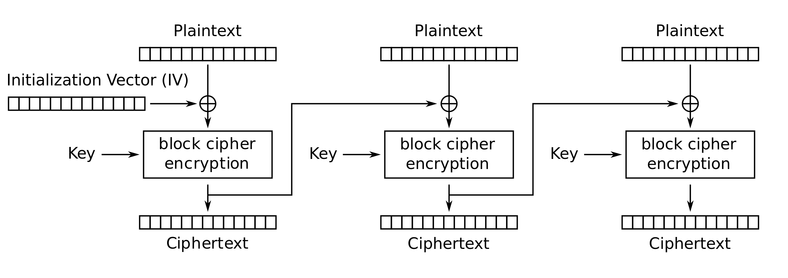
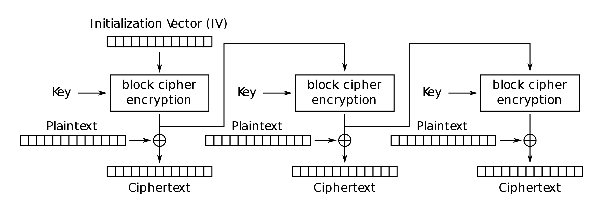

Instituto Superior Técnico, Universidade de Lisboa

**Network and Computer Security**

# Lab guide: Java Cryptographic Mechanisms

## Goals

- Use the cryptographic mechanisms available in the Java platform.
- Perform attacks exploiting vulnerabilities introduced by the bad use of cryptography.

## Introduction

This laboratory assignment uses Java Development Kit (JDK) version 7 or later, running on Linux. The Java platform strongly emphasizes security, including language safety, cryptography, public key infrastructure, secure communication, authentication and access control.

The Java Cryptography Architecture (JCA), which is a major piece of the Java platform, includes a large set of application programming interfaces (APIs), tools, and implementations of commonly-used security algorithms, mechanisms, and protocols. It provides a comprehensive security framework for writing applications and also provides a set of tools to securely manage applications.

The JCA APIs include abstractions for secure random number generation, key generation and management, certificates and certificate validation, encryption (symmetric/asymmetric block/stream ciphers), message digests (hashes), and digital signatures. Some examples are the MessageDigest, Signature, KeyFactory, KeyPairGenerator, and Cipher classes.

Implementation independence, in the Java platform, is achieved using a _provider_-based architecture. The term Cryptographic Service Provider (CSP) refers to a package or set of packages that implement one or more cryptographic services, such as digital signature algorithms, message digest algorithms, and key conversion services. A program may simply request an object, e.g., a MessageDigest object, implementing a particular service, e.g., the SHA-256 digest algorithm, and get an implementation from one of the installed providers. A program may instead request, if necessary, an implementation from a specific provider.

To obtain a security service from an underlying provider, applications rely on the relevant getInstance() method. The message digest creation, for example, represents one type of service available from providers. To obtain an implementation of a specific message digest algorithm, an application invokes the getInstance() method in the java.security.MessageDigest class.

```java
MessageDigest md = MessageDigest.getInstance("SHA-256");
```

Optionally, by indicating the provider name, the program may request an implementation from a specific provider as in the following:

```java
MessageDigest md = MessageDigest.getInstance("SHA-256", "MyProvider");
```

Providers may be updated transparently to the application when faster or more secure versions are available. In the Java platform, the java.security.Provider class is the base class for all security providers. Each CSP contains an instance of this class which contains the provider&#39;s name and lists all the security services/algorithms it implements. Multiple providers may be configured at the same time and are listed in order of preference. The highest priority provider that implements that service is selected when a security service is requested.

For more information, please read:

[http://docs.oracle.com/javase/8/docs/technotes/guides/security/crypto/CryptoSpec.html#Introduction](http://docs.oracle.com/javase/8/docs/technotes/guides/security/crypto/CryptoSpec.html#Introduction)


## Cryptographic mechanisms

Copy the lab files into /tmp/JavaCrypto and change your working directory to it 

```bash
$ cd /tmp/JavaCrypto 
```

Compile the code:

```bash
$ javac src/pt/ulisboa/tecnico/meic/sirs/
```
You will also need to define the Classpath environment variable. 
The Classpath is a parameter that specifies the location of user-defined classes and packages. 
(for .class files in a named package, the Classpath must end with the directory that contains the first package in the full package name).

```bash
$ export CLASSPATH="/tmp/JavaCrypto/src"
```

Please notice that all steps that follow expect that this was done, so you must change commands to an alternative path, if necessary.

**Note** : For every java command, please write the full package names and file paths. They are ommitted for brevity in this guide.

```bash
$ java pt.ulisboa.tecnico.meic.sirs.RandomImageGenerator # instead of just $ java RandomImageGenerator
```

In the directory intro/inputs, you can find 3 different images:

- Tecnico: \*.png, the IST logo
- Tux: \*.png, Tux, the Linux penguin
- Glider: \*.png, the hacker emblem ([http://www.catb.org/hacker-emblem/](http://www.catb.org/hacker-emblem/))

Each one is presented with three different dimensions: 480x480, 960x960, and 2400x2400. 
The resolution number is part of the file name. 
The ImageMixer class is available to facilitate the operations on images. 
Different code examples are available, such as the RandomImageGenerator, ImageXor, and ImageAESCipher classes.

### One-Time Pads (Symmetric stream cipher)

If they could be correctly used in practice, one-time pads would provide perfect security. 
One of the constraints to make them work as expected is that the key stream must never be reused. 
The following steps visually illustrate what happens if they are reused, even if just once:

Generate a new 480x480 random image:

```bash
$ java RandomImageGenerator intro/outputs/otp.png 480 480
```

Perform the bitwise eXclusive OR operation (XOR) with the generated key:

```bash
$ java ImageXor intro/inputs/tecnico-0480.png intro/outputs/otp.png intro/outputs/encrypted-tecnico.png
```

XOR tux-0480.png with the same generated key:

```bash
$ java ImageXor intro/inputs/tux-0480.png intro/outputs/otp.png intro/outputs/encrypted-tux.png
```

Watch the images encrypted-tecnico.png and encrypted-tux.png. 
Switch between them and see the differences.

To make the differences obvious, XOR them together:

```bash
$ java ImageXor intro/outputs/encrypted-tecnico.png intro/outputs/encrypted-tux.png intro/outputs/tecnico-tux.png
```

You can see that the reuse of a one-time pad (or any stream cipher key at all) considerably weakens (or completely breaks) the security of the information. 
The reason is the following:         

```
C1 = M1 ⊕ K

C2 = M2 ⊕ K

C1 ⊕ C2 = M1 ⊕ M2
```

Legend: C stands for cipher-text, M for plain-text, K for key, ⊕ for XOR

The result you get is the XOR of the images. 
You can experiment with other images and sizes.


### Block cipher modes

Now that you know that keys should never be reused, remember that the way you use them is also important. 

We will use a symmetric-key encryption algorithm working in blocks to encrypt the pixels from an image.
We will use different modes, namely:
ECB (Electronic Code Book), CBC (Cipher Block Chaining) and OFB (Output FeedBack).

#### ECB (Electronic Code Book)

In the ECB mode, each block is independently encrypted with the key:

```
C[i] = E_k(M[i])
```



Begin by generating a new AES Key:

```bash
$ java AESKeyGenerator w intro/outputs/aes.key
```

Then, encrypt the glider image with it:

```bash
$ java ImageAESCipher intro/inputs/glider-0480.png intro/outputs/aes.key ECB intro/outputs/glider-aes-ecb.png
```

Watch the output image. 
Remember what you have just done: encrypted the image with AES, using ECB mode, and a key you generated yourself.

Feel free to try the same thing with the other images (especially with other sizes).

Try using Java providers to generate a new AES key, by creating a DESKeyGenerator based on the AESKeyGenerator class. 
What is necessary to change in the code for that to happen?

Repeat all the previous steps for the new key.

Compare the results obtained using ECB mode with AES with the previous ones. 
What are the differences between them?

#### CBC (Cipher Block Chaining)

In CBC mode, each block M[i] is XORed with the ciphertext from the previous block, and then encrypted with key k: 

```
C[i] = E_k (M[i] ⊕ C[i-1])
```



The encryption of the first block can be performed by means of a random and unique value known as the Initialization Vector (IV). 

The AES key will be the same from the previous step.

Encrypt the glider image with it, this time replacing ECB with CBC:

```bash
$ java ImageAESCipher intro/inputs/glider-0480.png intro/outputs/aes.key CBC intro/outputs/glider-aes-cbc.png
```

Watch the file glider-aes-cbc.png. 
See the difference made by changing only the mode of operation.

Still in the CBC mode, you might have wondered why the IV is needed in the first block. 
Consider what happens when you encrypt two different images with similar beginnings, and with the same key: the initial cipher text blocks would also be similar!

The ImageAESCipher class provided has been deliberately weakened: instead of randomizing the IV, it is always the same.

This time, encrypt the other two images with AES/CBC, still using the same AES key:

```bash
$ java ImageAESCipher intro/inputs/tux-0480.png intro/outputs/aes.key CBC intro/outputs/tux-aes-cbc.png

$ java ImageAESCipher intro/inputs/tecnico-0480.png intro/outputs/aes.key CBC intro/outputs/tecnico-aes-cbc.png
```

Now watch the images glider-aes-cbc.png, tux-aes-cbc.png, and tecnico-aes-cbc.png.
Look to the first lines of pixels. 
Can you see what is going on?


#### OFB

In the OFB mode, the IV is encrypted with the key to make a keystream that is then XORed with the plaintext to make the cipher text.



In practice, the keystream of the OFB mode can be seen as the one-time pad that is used to encrypt a message. 
This implies that in OFB mode, if the key and the IV are both reused, there is no security.

Encrypt the images with OFB:

```bash
$ java ImageAESCipher intro/inputs/glider-0480.png intro/outputs/aes.key OFB intro/outputs/glider-aes-ofb.png

$ java ImageAESCipher intro/inputs/tux-0480.png intro/outputs/aes.key OFB intro/outputs/tux-aes-ofb.png

$ java ImageAESCipher intro/inputs/tecnico-0480.png intro/outputs/aes.key OFB intro/outputs/tecnico-aes-ofb.png
```

Remember that the ImageAESCipher implementation has been weakened, by having a null IV, and you are reusing the same AES key. 
Watch the generated images and switch quickly between them.

Take two images (e.g., image1 and image2) and cipher them both. 
XOR image1 with the ciphered image2. 
What did you obtain? 
Why?

What is more secure to use: CBC or OFB?


### Asymmetric ciphers

The goal now is to use asymmetric ciphers, with separate private and public keys.
RSA is the most well known of these algorithms.

#### Generating a pair of keys with OpenSSL

Generate the key pair:

```bash
$ openssl genrsa -out server.key
```

Save the public key:

```bash
$ openssl rsa -in server.key –pubout \&gt; public.key
```

#### Generating a self-signed certificate

Create a Certificate Signing Request, using same key:

```bash
$ openssl req -new -key server.key -out server.csr
```

Self-sign:

```bash
$ openssl x509 -req -days 365 -in server.csr -signkey server.key -out server.crt
```

For our certificate to be able to sign other certificates, OpenSSL requires that a database exists (a .srl file). 
Create it:

```bash
$ echo 01 > server.srl
```

Then, generating a key for a user is basically repeating the same steps (see commands above), except that the self-sign no longer happens and is replaced by:

```bash
$ openssl x509 -req -days 365 -in user.csr -CA server.crt -CAkey server.key -out user.crt
```

Sign the file grades.txt with the user certificate:

```bash
$ openssl dgst -sha256 grades/inputs/grades.txt \&gt; grades.sha256

$ openssl rsautl -sign -inkey user.key -keyform PEM -in grades.sha256 \&gt; grades.sig
```

Verify the signature with the user key:

```bash
$ openssl rsautl -verify -in grades.sig -inkey user.key

SHA256(/tmp/sirs/grades/inputs/grades.txt)= 770ddfe97cd0e6d279b9ce780ff060554d8ccbe4b8eccaed364a8fc6e89fd34d
```

and should always match this:

```bash
$ openssl dgst -sha256 grades/inputs/grades.txt

SHA256(/tmp/sirs/grades/inputs/grades.txt)= 770ddfe97cd0e6d279b9ce780ff060554d8ccbe4b8eccaed364a8fc6e89fd34d
```

Verify the user certificate:

```bash
$ openssl verify -CAfile server.crt user.crt
```

user.crt: OK

#### Reading the generated pair of keys with Java

To read the generated keys in Java it is necessary to convert them to the right format.

Convert the private key to PKCS8:

```bash
$ openssl pkcs8 -topk8 -inform PEM -outform DER -in server.key -nocrypt \&gt; server\_pkcs8.key
```

Read the key files using the following command:

```bash
java RSAKeyGenerator r server\_pkcs8.key server.crt
```


#### Generating a pair of keys with Java

Generate a new pair of RSA Keys.

```bash
$ java RSAKeyGenerator w intro/outputs/priv.key intro/outputs/pub.key
```

Based on the ImageAESCipher class create ImageRSACipher and ImageRSADecipher classes.

Encrypt the image with the public key and then decrypt it with the private key.
Try the same thing with the other images - especially with other sizes.

Please consider that the RSA cipher, as implemented by Java, can only be applied to one block of data at a time, and its size depends on the size of the key. 
For a 1024-bit key the block size is 117 bytes or 60 bytes, depending on the padding options. 
This is acceptable because the RSA cipher is mostly used to cipher keys or hashes that are small. 
For large data, hybrid cipher is most suited (combining RSA with AES, for example). 
For this exercise you can cipher one block at a time.


### Additional exercise (file tampering)

In the directory grades/inputs, you can find the file grades.txt, the plaintext of a file with the grades of a course.
This flat-file database has a rigid structure: 64 bytes for name, and 16 bytes for each of the other fields, number, age and grade. Unfortunately, you happen to be _Mr. Thomas S. Cook_, and your grade was not on par with the rest of your class because you studied for a different exam...

Begin by encrypting this file into ecb.aes. 
For this example, we will still reuse the AES key generated above and ECB mode.

```bash
$java FileAESCipher grades/inputs/grades.txt intro/outputs/aes.key ECB grades/outputs/grades.ecb.aes
```

Keeping in mind how the mode operations work, and without using the secret key, try to change your grade to 21 in the encrypted files or give everyone in class a 20.
(Why 21 or all 20s? Because you are an _ethical hacker_ using your skills to show that the system is vulnerable, not perform actual cheating.)

Did you succeed? 
Did your changes have side effects?

Now try to attack cbc.aes and ofb.aes. For this example, we will still reuse the AES key generated above but use the CBC and OFB modes.

```bash
$java FileAESCipher grades/inputs/grades.txt intro/outputs/aes.key CBC grades/outputs/grades.cbc.aes

$java FileAESCipher grades/inputs/grades.txt intro/outputs/aes.key OFB grades/outputs/grades.ofb.aes
```

How do you compare the results with EBC?

Since the inputs and outputs of cryptographic mechanisms are byte arrays, in many occasions it is necessary to represent encrypted data in text files. 
A possibility is to use base 64 encoding that, for every binary sequence of 6 bits, assigns a predefined ASCII character.
Execute the following to create a base 64 representation of files previously generated.

```bash
$java Base64Encode grades/outputs/grades.cbc.aes grades/outputs/grades.cbc.aes.b64
```

Decode them:

```bash
$java Base64Decode grades/outputs/grades.cbc.aes.b64 grades/outputs/grades.cbc.aes.b64.decoded
```

Check if they are similar using the diff command (or fc /b command on Windows):

```bash
$diff grades/outputs/grades.cbc.aes grades/outputs/grades.cbc.aes.b64.decoded
```

It should not return anything.

Check the difference on the file sizes. 
Can you explain it? 
In percentage, how much is it?

Does base 64 provide any kind of security? 
If so, how?

Use Java to generate the message authentication code (MAC) and digital signature of the grades file. 
By performing these operations, which security requirements can be guaranteed?


**Acknowledgments**

Original version: Valmiky Arquissandas

Revisions: Diogo Peres Castilho, David R. Matos, Miguel Pardal
